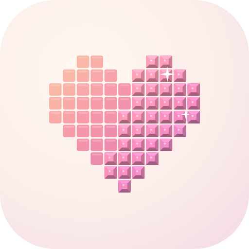

# Tessel



Jeu de coloriage relaxant pour Android : pixel art par numéros, diamond painting, point de croix et mosaïque.
Des mois de progression douce, **sans achats intégrés ni publicité**, entièrement hors ligne.

- 200 œuvres (illustrations, générateurs procéduraux, chefs-d'œuvre du domaine public), une œuvre du jour,
  des événements saisonniers et des collections ;
- 4 modes de rendu GPU (PixiJS v8 + shaders GLSL), 19 matières et 40 cadres à débloquer ;
- import de photos, éditeur de pixel art, partage en fichier `.tessel` ou en QR code ;
- galerie personnelle, exports (image HD, vidéo MP4 / GIF du timelapse, fond d'écran) ;
- 8 musiques composées en code, 5 ambiances, niveaux, quêtes, succès, séries, coffres ;
- mises à jour de l'application depuis les GitHub Releases.

## Lancer

```bash
npm ci
npm run dev              # http://localhost:5173 (données en base locale du navigateur)
```

Paramètres utiles : `?nodb` (partie de démonstration sans base), `?nodb&mode=diamond&size=120`.
Menu de debug caché : **7 appuis rapides sur l'onglet Profil** (compléter l'œuvre, forcer la date, XP, outils,
coffres, tout débloquer, rejouer les animations clés).

Vérifications (les mêmes qu'en CI) :

```bash
npm run lint && npm run typecheck && npm test && npm run format:check
```

## Construire l'APK

Prérequis : JDK 21, SDK Android.

```bash
npm run android:debug    # build web + cap sync + gradlew assembleDebug
# APK : android/app/build/outputs/apk/debug/app-debug.apk
```

La CI (`.github/workflows/ci.yml`) produit aussi l'APK de debug en artefact (`tessel-debug-apk`).

## Publier une version

Chaque merge sur `main` passe par `semantic-release` (`.github/workflows/release.yml`) : la version est calculée
depuis les commits conventionnels (`feat` = mineure, `fix`/`perf` = correctif, `BREAKING CHANGE` = majeure),
l'APK signé et son `.sha256` sont joints à la GitHub Release. Aucun commit pertinent : aucune release.
Détails, secrets de signature et commande `keytool` : [docs/RELEASE.md](docs/RELEASE.md).

## Ajouter des œuvres

- **Illustrations SVG** : `assets/art/svg/<catégorie>/<nom>.svg` + titre dans `meta.json`, règles dans
  [docs/ART.md](docs/ART.md), aperçu avec `scripts/art/preview-svg.ts`.
- **Générateurs** : `src/content/generators/`, déclarés dans `assets/art/generated.json`.
- **Domaine public** : `scripts/art/import-pd.ts` (licence vérifiée par l'API du musée), crédits dans
  `assets/art/CREDITS.md`.
- Puis reconstruire la bibliothèque (grilles précalculées dans `public/art/`) :
  `npx tsx --tsconfig tsconfig.app.json scripts/art/build-library.ts`.

## Remplacer les musiques

Les musiques sont des boucles : le jeu les fait tourner à l'échantillon près, sans fondu, et enchaîne les
pistes cochées par le joueur en fondu enchaîné. Les sons sont lus depuis `public/audio/tracks.json` (copié
depuis `assets/audio/tracks.json`) et les fichiers `assets/audio/music/*.ogg`, `assets/audio/ambience/*.ogg`.
Pour mettre de vraies musiques :

1. déposer des boucles sans couture (Ogg Opus ou MP3, 48 kHz, environ -16 LUFS) dans `assets/audio/music/` ;
2. mettre à jour `assets/audio/tracks.json` (`id` = `music:1` … `music:8`, `file`, `title`, `seconds`,
   `samples` = longueur exacte de la boucle en échantillons à 48 kHz, `offset` facultatif) et les titres
   dans `src/meta/catalog.ts` ;
3. copier `assets/audio/` dans `public/audio/`, puis vérifier les jonctions (serveur de dev lancé) :
   `npx tsx scripts/audio/check-loops.ts`.

Pour régénérer les pistes composées en code (Tone.js, deux périodes rendues hors ligne dans Chromium pour
une jonction parfaite, normalisation BS.1770 à -16 LUFS, encodage Opus) : serveur de dev lancé, puis
`npx tsx --tsconfig tsconfig.app.json scripts/audio/prerender.ts [music:3 …]`.

## Architecture

Vue d'ensemble dans [docs/ARCHITECTURE.md](docs/ARCHITECTURE.md), guide des écrans dans [docs/UI.md](docs/UI.md).

| Dossier               | Rôle                                                                |
| --------------------- | ------------------------------------------------------------------- |
| `src/engine`          | rendu GPU, caméra, gestes, partie                                   |
| `src/modes`           | les 4 modes (GLSL) et leurs matières                                |
| `src/convert`         | conversion de photos (OKLab, quantification, tramage, worker)       |
| `src/content`         | bibliothèque, générateurs, œuvre du jour, événements, collections   |
| `src/create`          | éditeur de pixel art, format `.tessel`, QR codes                    |
| `src/meta`            | niveaux, quêtes, succès, séries, coffres, déblocages                |
| `src/render`          | rendu hors écran, exports image / vidéo / fond d'écran              |
| `src/db`              | SQLite, migrations, sauvegarde continue                             |
| `src/audio`           | moteur audio, effets synthétisés, musique et ambiances              |
| `src/update`          | mises à jour depuis GitHub (semver, SHA-256)                        |
| `src/ui`, `src/theme` | interface (thèmes Doux / Material You / Clair / Sombre), mouvement  |
| `scripts`             | import d'œuvres, pré-rendu musical, icônes, outils de développement |

## Licences

Code : voir `LICENSE` si présent. Œuvres du domaine public : `assets/art/CREDITS.md`. Sons : `assets/audio/CREDITS.md`.
